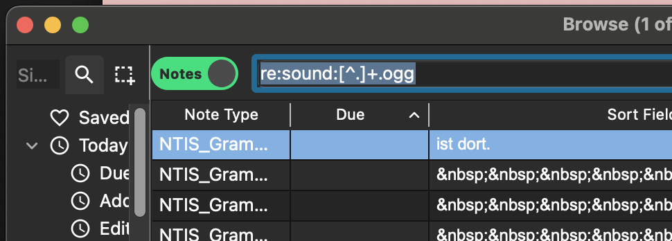
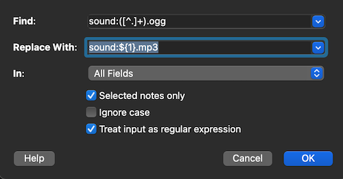

## Anki, the spaced repetition software, support audio files in a variety of formats

I use Anki to practice my German, as well as other things. It's somewhat clunky, but reasonably powerful. You can author your own cards, and add images and audio in a variety of formats. In the Anki forums the recommended source for language audio files is [forvo](https://forvo.com), but I have added a lot from [wiktionary](https://de.wiktionary.org/wiki/Geschwindigkeitsbegrenzung). They seem of better quality, they sound as if they were recorded by a voice actor. They are also easier to download.

(For an introduction to Anki, see [How to Use Anki: An Efficient Tutorial for Beginners](https://leananki.com/how-to-use-anki-tutorial/), and for an introduction to the concept of spaced repetition see [Spaced Repetition: A Guide to the Technique](https://e-student.org/spaced-repetition/))

## Anki supports .ogg, but iOS doesn't

The issue is that wiktionary's sound files are in .ogg format, which works well enough for the desktop version of Anki. But when you try to access them with the iPhone app, they don't play back. iOS doesn't support the format. And there are no workarounds.

## Converting .ogg files to .mp3 in place

Anki stores its data in a local SQLite database. I was afraid I was going to need to start manually changing database fields (always a recipe for disaster). But it turns out not to be too difficult. It's pretty much a two steps procedure: 1) Converting .ogg files to .mp3 in place, 2) find and replace the name of the sound files in the cards, 3) Remove the .ogg files.
OK, _three_ steps.

This is what I did to do the conversion. If you decide to do the same at your own risk, I suggest you duplicate the SQLite db first. You can find [the location of the database](https://docs.ankiweb.net/files.html#file-locations) in the documentation.

### 1. Converting .ogg files to .mp3 in place

On a Mac, media files are in a folder like `~/Library/Application Support/Anki2/User 1/collection.media` (if you have different users the path will be slightly different, but you should be able to work it out). Then you can run a single command to do the conversion. The command uses `ffmpeg`. The documentation suggests you quit Anki before making changes to those files.

```bash
# if you don't have ffmpeg, install it with
❯ brew install ffmpeg

❯ find "~/Library/Application Support/Anki2/User 1/collection.media" -type f -name "*.ogg" -exec sh -c 'for file do ffmpeg -i "$file" "${file%.ogg}.mp3"; done' sh {} +
```

This will create am .mp3 copy of each .ogg file, in the same folder. Anki monitors that folder and will become aware of the new files, you don't need to do anything.

### 2. find and replace the name of the sound files in the cards

Now open up Anki, and find the cards with .ogg files in them.

1. click on the 'browse' button. That will open a new window
   
1. in the browser window search box, enter `re:sound:[^.]+.ogg`. This will find all the cards with a field with a sound file called anything dot ogg. Select them all.
   
1. Right click on the list, and choose 'Find and Replace...'
1. In the find and replace popup, enter `sound:([^.]+).ogg` for find, and `sound:${1}.mp3` for replace. Make sure "Treat input as regular expression" and "Selected notes only" are ticked
   
1. In the browse window, click on the 'Preview' button, and make sure everything worked.
1. If something went wrong and you want to undo everything, go to Preferences > Syncing > "On next sync force changes in one direction", then do a sync. Make sure you pick "Download from Ankiweb"

That should be it.

### 3. Clean up media

Go back to the main window and select Tools > Check Media. This will remove the old .ogg files
