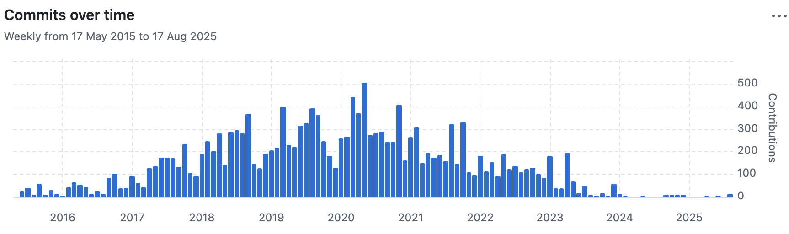

## Javascript is not sustainable

JavaScript was my first love, but I have to admit defeat. With JS it is no longer feasible to have projects you only touch occasionally. Everything moves so fast, bit rot happens after only a few months. For example, my [Astro](https://astro.build/) blog was completely broken after only two months of me building it. And I had moved to Astro from [SvelteKit](https://svelte.dev/) after that version also became broken because of bit rot. That's why I have no intention to try [Next.js](https://nextjs.org/), [Remix](https://remix.run/), or any of the other React-based frameworks.

## The Javascript ecosystem is not interested in static site generators (SSGs)

One of the things that didn't work for me in Astro was setting the 'draft' flag for collections, which wasn't implemented. I submitted a ticket, and after a few comments one of the contributors mentioned that (emphasis mine)

> Drafts were introduced back before Astro 1.0, **when Astro was purely a static site generator** and .md/x pages were our recommended way of working with content. Since then, Astro's capabilities and scope have grown to accommodate many different hosts and server runtimes. As such, we feel that the drafts feature as originally designed doesn't fit with our current approach to content.

In other words, Astro has no interest in being an SSG. Of the established site creation frameworks, only [Gatsby](https://www.gatsbyjs.com/docs/) seems to support being a static site generator. Wait, did I say "established"? It may have been five years ago, but as of 2025 [Gatsby is pretty much dead](https://bejamas.com/blog/gatsby-going-down-and-taking-your-website-along). So what's left?



### Eleventy seemed too old school

But wait, what about [Eleventy](https://www.11ty.dev/)! That is old school, right? No overengineered hydration / server-side rendering / GraphQL behind it. I tried, but looking at the available themes and code it seems to be _too_ old school - sorry I'm not using SASS in 2025. And of course, it is JS-powered. Wasn't convinced.

## Criteria for my next static site generator

I like markdown-powered static site generators. If they are feature complete they do a great job for me. I shortlisted a few: [Hugo](https://jamstack.org/generators/hugo/), [Zola](https://jamstack.org/generators/zola/), [Pelican](https://jamstack.org/generators/pelican/). Hugo came out on top.

### ✅ Proof of longevity

For my own personal blog I want to stay as far away from the bleeding edge as humanly possible, without falling into the opposite trap of it being _too_ old school. Hugo is 12 years old and has an active community, so it passed that check.

### ✅ The basics

What I expect from a modern SSG generator is:

- hot module reloading
- handling draft posts (visible locally but not on prod). It seems obvious, but Astro doesn't, for example
- functional RSS and sitemap by default, or at least with little fiddling. Again, something JS frameworks often struggle with

### ✅ No JS

I've gone off JS altogether, and I certainly don't need it for my blog. Hugo is written in Go, so it's just a binary. _EDIT_ turns out I needed to install npm just to enable the code formatting plugin in VSCode after all...

### No SASS

Both Zola and Hugo were created at a time when SASS still seemed a good idea, but you don't have to use it. It depends on the theme rather than the framework itself.

### ✅ Markdown powered

Hugo is Markdown-native, which made things so much easier. There were some glitches with the front matter format. For example it is fussy with date formatting. It also uses `+++` as delimiter instead of `---` like all my posts. But that was easily changed with

```toml
# in hugo.toml

# to use --- for frontmatter
metaDataFormat = "yaml"
```

### ✅ Store the .md files away from the code

It is trivial to have the markdown files anywhere on your file system, something that seems to be beyond most JS frameworks I've tried

```toml
# in hugo.toml

[module]
[[module.mounts]]
source = "/an/absolute/path/"
target = "content"
```

### ✅ Group post assets together with their post

One customisation I found myself making to most SSG engines I used is to have the posts' markdown files in their own folder, and allow all the post images / support files to be in the same folder. It's not always possible, and when it is it may not survive an update.

```bash
├── /an/absolute/path/
│   ├── post-x
│   │   ├── index.md
│   │   ├── an-image.png
│   ├── post-y
│   │   ├── index.md
```

Hugo has the ability built in, they are called [page bundles](https://gohugo.io/content-management/page-bundles/)

### ✅ Allow adding anything I fancy to the front matter as markdown, and make it accessible to the post

I put the initial paragraph of each post as 'description' in the front matter, so that it can be easily pulled by various plugins like, for example, the RSS one. Hugo lets you treat the front matter pretty much as a mini database, you can put whatever you want there. `markdownify` will convert it for you, if you need to. No hassle at all.

```twig
Some HTML oh look here comes <div>{{ .Description | markdownify }}</div>
```

### 🚫 Allow yyyy-mm-dd naming convention for posts

Hugo doesn't have built-in support for the yyyy-mm-dd-post-slug.md format. This is no surprise, as far as I know only [Jekyll](https://jekyllrb.com/) does that (it's where I got the idea from). In the Astro and Svelte version I built custom plugins to handle that, but this time for the sake of simplicity I simply created [a quick Python script to add a "slug" entry to the front matter](https://gist.github.com/gotofritz/899007f5ebf2d66d762c1e91451c474e). That has the added benefit that it is also understood by the RSS generator.

To create new posts I need to use the command

```bash
hugo new "blog/$(date +%Y-%m-%d)-my-post/index.md
```

which is not elegant, but not the end of the world.

### ✅ VSCode integration

Probably the most complicated part of the whole setup was finding out how to auto-format the HTML template. I first went on a wild goose chase looking for Twig formatters, but none of them worked well. Then I came across a Prettier plugin called [prettier-plugin-go-template](https://github.com/NiklasPor/prettier-plugin-go-template). It's no longer maintained, but it still works quite well. However it is a bit awkward, in that you have to add Prettier to your project, even if it would otherwise have no JS.

```bash
# Install prettier
❯ npm install -D prettier prettier-plugin-go-template
...
```

Then in my project's settings (`.vscode/settings.json`)

```json
{
  ...
  "prettier.prettierPath": "./node_modules/prettier/index.cjs",
  ...
}
```

And then I created a `.prettierrc` file at the root of the project with

```json
{
	"plugins": ["prettier-plugin-go-template"],
	"overrides": [
		{
			"files": ["*.html"],
			"options": {
				"parser": "go-template",
				"tabWidth": 4,
				"useTabs": true,
				"singleQuote": true
			}
		}
	]
}
```

The plugin works very well, the only problem is that it may stop working any moment since VSCode and Prettier are JS tools.

### ✅ Nice to have: prev / next navigation

Next / Prev buttons are useful to me when I check the website. This is one thing I always had to code myself in JS-based blog engines. Hugo provides it out of the box.

```twig
{{ with $pages.Next . }}
	<a
		href="{{ .Permalink }}"
		rel="prev"
		class="main-post__prev-link"
		>{{ .Title }} &gt;&gt;</a
	>
{{ end }}
```

### ✅ Nice to have: CSS minification

CSS minification is no longer a thing in 2025, still, it doesn't hurt. Comes out of the box with

```twig
{{ with resources.Get "css/main.css"| resources.Minify }}
	<link rel="stylesheet" href="{{ .RelPermalink }}" />
{{ end }}
```

## Conclusion

Hugo seems the perfect tool for the job. I found a theme with no JS and no SASS, [bearblog](https://github.com/janraasch/hugo-bearblog), and I was good to go. I hope I can stick to this tool for as long as possible.
