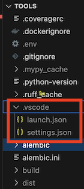
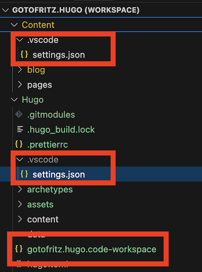

## ...a "normal" project?

If you open a folder in VSCode, it will create a `.vscode/` folder with the settings and that's basically your "normal" project. A one-folder project.

You can also have [workspaces](https://code.visualstudio.com/docs/editing/workspaces/workspaces), which are projects made up of different folders scattered on your hard disk. For example, the code for this blog is a workspace with two folders - the code, and the markdown posts, which are somewhere completely different.

In reality all projects are based on workspaces, even the single folder ones. The difference is that you don't see the workspace definition file when you work with a single folder. But when you want multiple folders, that's when you need to create a `project.code-workspace` file.

## The problem

cSpell highlights all the incorrect words, but sometimes they are false positives and the word is correct. Then you can add it to a whitelist and it won't check it again. This works well for "normal" vscode project, but wasn't doing anything for a workspace based project.

## The cause

As I discovered in [this Github issue](https://github.com/streetsidesoftware/vscode-spell-checker/issues/2945), when cSpell highlights a word, it gives you the option to whitelist it for the user (i.e., across all your projects) or the workspace. If it's a single folder project, it will save the whitelist in `.vscode/settings.json` within the folder.

If you have a multi-folder project, you get _three_ options: user, workspace, and folder. In this case, "workspace" means a `.vscode/settings.json` in the same place where your workspace definition file is. "folder" means a `.vscode/settings.json` inside that specific folder. So a project can end up having multiple `.vscode/settings.json` in different folders. And that's exactly where the problem lies.

If you whitelist even a single word for the folder, the whitelist for the whole workspace is no longer visible. cSpell is unable to merge the two; it just picks one.

## The solution

The solution is to manually copy the whitelist from the folder's `.vscode/settings.json` to the one in the workspace's `.vscode/settings.json`, then delete the former.
