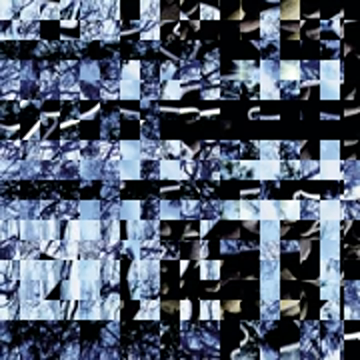
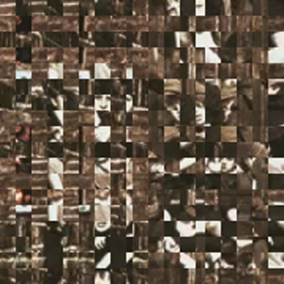

## Introduction

One of the most useful commands in Hugo is `hugo new`, which helps users quickly create new content files. Its basic form is already quite sophisticated:

```bash
hugo new "blog/hello-world.md"
```

This command understands that it should use the blog template to generate some scaffolding. At the same time, it's quite basic. If I want to prefix the filename with today's date, I can do:

```bash
hugo new "blog/$(date +%Y-%m-%d)-hello-world.md"
```

If want to create a [page bundle](https://gohugo.io/content-management/page-bundles/), which is a folder that holds all the assets for that page as well as the page itself, I can do:

```bash
hugo new "blog/$(date +%Y-%m-%d)-hello-world/index.md"
```

I like to create preview images for my posts because I publish them to Mastodon to allow comments. Without a preview image, posts look broken. So I needed an extra step after post creation.

Finally, if my post is called "Hello, world!", I want a command that lets me type `[command] 'Hello world!'` and have it automatically figure out the URL, rather than the other way around. That's why I created [a bash script](https://github.com/gotofritz/gotofritz.github.io/blob/main/scripts/hugo-new).

## The set up

The command is called `hugo-new` and lives in `./scripts` in the project folder. When I load up hugo in my editor, I can run

```bash
export PATH="$PATH:./scripts"
```

Once done, all scripts in `./scripts` are available without prefix. In other words, I can just type:

```bash
hugo-new "blah blah"
```

and the script will create the page bundle with a primed markdown file and a glitch preview image. The images look like this





## The script

The command itself is fairly simple - a wrapper for the Hugo command above. The more complicated part is the ffmpeg command that generates a glitchy preview image from one of my videos. That part was generated with the help of a local LLM (qwen3-coder). Despite its odd preference for using awk for random numbers, it worked fine.

```bash
#!/bin/bash

# Check if TITLE is provided
if [ -z "$1" ]; then
  echo "Usage: $0 \"Your Title Here\""
  exit 1
fi

TITLE="$1"

# URLize the title (convert to lowercase, replace spaces with hyphens)
URLIZED_TITLE=$(echo "$TITLE" | tr '[:upper:]' '[:lower:]' | sed 's/[^a-zA-Z0-9-]/-/g' | sed 's/-*$//')

# This is the basic command we are wrapping: creates a blog post scaffold
hugo new "blog/$(date +%Y-%m-%d)-$URLIZED_TITLE/index.md"

# Pick a random MP4 from my video collection
INPUT=$(find /Users/fritz/.yarkie/videos -type f -name "*.mp4" | sort -R | head -n 1)

# Get video width, height, and duration
WIDTH=$(ffprobe -v error -select_streams v:0 -show_entries stream=width -of csv=p=0 "$INPUT")
HEIGHT=$(ffprobe -v error -select_streams v:0 -show_entries stream=height -of csv=p=0 "$INPUT")
DURATION=$(ffprobe -v error -select_streams v:0 -show_entries format=duration -of csv=p=0 "$INPUT")

# Pick a random split in the central square (clamped between 1/4 and 3/4 of width)
SPLIT=$(awk -v w=$WIDTH 'BEGIN{srand(); print int(w/4 + (w/2)*rand())}')

# Determine final square because the preview should be square, but most mp4's are not
SQUARE=$(( WIDTH < HEIGHT ? WIDTH : HEIGHT ))

# Pick a random time between 20% and 80% of duration
SS=$(awk -v dur=$DURATION 'BEGIN{srand(); print dur*0.2 + dur*0.6*rand()}')

# - Crops a central square from the video
# - Splits the square into left and right parts
# - Applies transformations to create glitch effects with shufflepixels
# - Overlays the glitched parts back onto the base image
# - Scales and crops to a square aspect ratio
# - Saves the image in the same page bundle where the markdown file is
ffmpeg -y -ss $SS -i "$INPUT" -filter_complex "
[0:v]crop=w=iw/2:h=ih/2:x=iw/4:y=ih/4[center];

[center]split=3[base][left][right];

[left]crop=w=$((SPLIT - WIDTH/4)):h=ih:x=0:y=0,shufflepixels,transpose=1,shufflepixels,transpose=2[leftglitch];
[right]crop=w=$((3*WIDTH/4 - SPLIT)):h=ih:x=$((SPLIT - WIDTH/4)):y=0,shufflepixels,transpose=2,shufflepixels,transpose=1[rightglitch];

[base][leftglitch]overlay=0:0[tmp];
[tmp][rightglitch]overlay=x=$((SPLIT - WIDTH/4)):y=0[glitched];

[glitched]scale=iw*2:ih*2,crop=$SQUARE:$SQUARE
" -frames:v 1 -update 1 "./content/blog/$(date +%Y-%m-%d)-$URLIZED_TITLE/feature.png"
```

## Small but perfectly formed

It's nothing revolutionary, but it neatly encapsulates most of the work involved in creating a blog post. Next step: handling direct posting to Mastodon!
