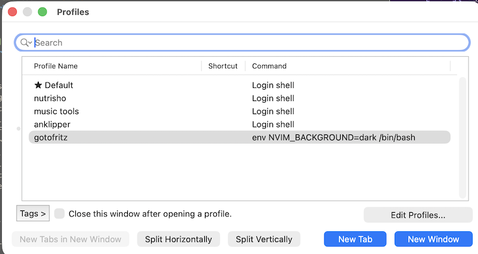
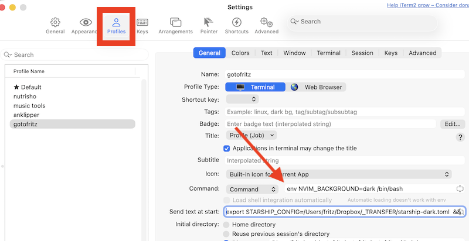
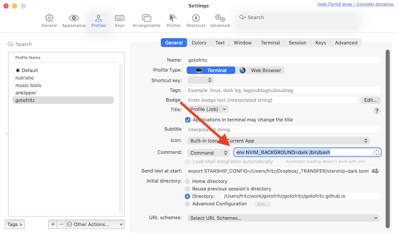

## The problem I am trying to solve

I keep several terminals open for different projects. I change the background colour of the terminal so that I can quickly tell which one I am looking at. Not all apps I use handle that well out of the box.
## Starship

[Starship](https://starship.rs/) is my prompt of choice. I like it because it's fast and it has, by default, pretty much all the bits I previously had to add manually, but configured in a TOML file.

Here's my current prompt

![My CLI prompt, showing  dependabot/go_modules/modernc-8f2ccc5f6e via 🐹 v1.27.0
[ 15:34:05 ] ~/work/gotofritz/timbuktu](./starship.png)

### The Issue with Starship

It doesn't handle light / dark mode. You have one config file and that's it. There's [an issue from a year ago (at the time of writing)](https://github.com/starship/starship/issues/6991) which looks like will never be tackled.

## iTerm2

[iTerm](https://iterm2.com/) (in reality iTerm2, but everyone calls it just iTerm) is my Terminal replacement. I don't think it's that great, to be honest, but it's a big improvement on the standard Apple Terminal, and I don't have the bandwidth to start experimenting with alternatives.

### Color Schemes in iTerm

I checked out the [iTerm2-Color-Schemes](https://github.com/mbadolato/iTerm2-Color-Schemes) repo, and then imported all of them into iTerm, as per the instructions. The repo is great because it has screenshots of each individual scheme.

### Per project profile

I understand iTerm can be set up to automatically switch profile depending on the current folder, but I haven't got that far. Right now I have simply created a bunch of profiles named after the projects I work on, and when I want to work on project X I open profile X. Each profile has its own colour scheme. It works well enough.



### The issue with iTerm

It's very configurable, but in a quirky, unintuitive, undocumented way which ends up wasting a lot of my time.

## neovim

Since I started writing this post, there have been some [bizarre goings-on in the neovim world](https://hachyderm.io/@davidculley/117180221746840524), so I am actually writing the post with [Helix](https://helix-editor.com/). But until a few days ago I was using [neovim](https://neovim.io/) with the [solarized theme](https://github.com/maxmx03/solarized.nvim)

### The issue with neovim and solarized

Neovim with the solarized theme gets its cursor settings from the terminal. I used solarized light, which would fire off even on a dark terminal. This didn't bother me too much, except that sometimes the dark cursor on the light theme became invisible because it had the same colour as the background.

## Hack to have light and dark mode in Starship

The only way to have dark and light mode seems to be to have two config files. I took the original one I use, starship.toml, then fed it to Claude Code to turn it into something suitable for dark mode, fine-tuned it, and then saved it as starship-dark.toml. Now the trick is to switch config file depending on the profile.

Starship reads the env variable `$STARSHIP_CONFIG` to decide which config file to load. So it should be just a matter of overwriting that for a particular profile. It should be easy enough. But it isn't in iTerm2; all it offers is  [very opaque and user-unfriendly approach](https://iterm2.com/documentation-scripting-fundamentals.html#setting-user-defined-variables) which I have no intention to explore. But I found that the (undocumented) setting `Send text at start` can be used for bash commands. So I send `export STARSHIP_CONFIG=/Users/fritz/Dropbox/_TRANSFER/starship-dark.toml  && /opt/homebrew/bin/starship init bash` which loads my settings from Dropbox (I keep them there because I use them at work too) and then reloads the profile. Not elegant, but functional.



### Hack to load neovim switch light / dark mode depending on iTerm profile

I do something similar for neovim. In this case I have to set an env variable using env and then restart bash, which I do by using a command and not the login shell, like for the other profiles. The command is `env NVIM_BACKGROUND=dark /bin/bash`. And no, it cannot be combined with the other variable setting, annoyingly.



Finally I change the nvim solarised setting to use whatever is set in `$NVIM_BACKGROUND` or use "light" if not set:

```bash
❯ nvim ~/.config/nvim/init.lua

# inside init.lua
1. /backgro to find the line with background
2. change to  vim.o.background = vim.env.NVIM_BACKGROUND or 'light'
3. `:wq` to save
```

And with that I got what I needed.
